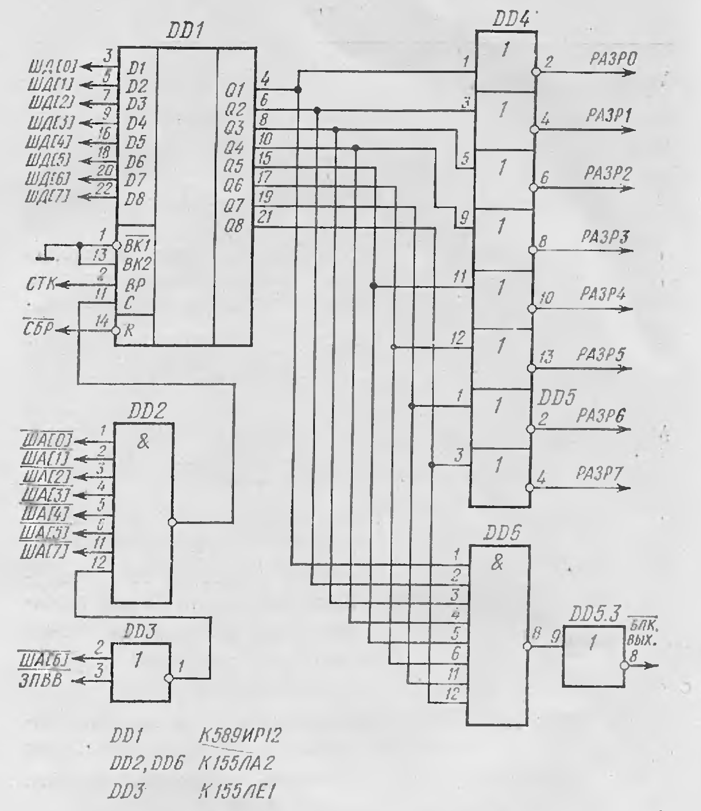
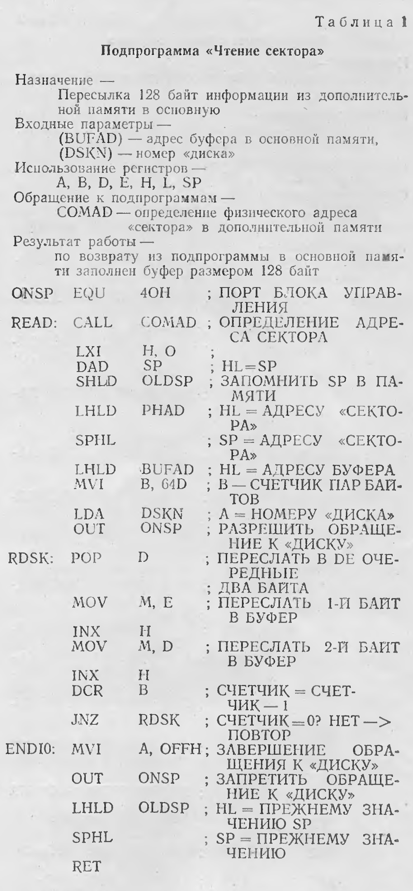

Журнал Микропроцессорные средства и системы

Электронный "квазидиск" для персональной ЭВМ.

В качестве внешней памяти микроЭВМ все чаще используют дополнительное ОЗУ большой емкости (имитаторы дисков). Это существенно снижает стоимость микроЭВМ и повышает ее быстродействие.

Авторами разработан образец микроЭВМ, для которой в качестве устройств ввода-вывода применяются бытовые приборы: телевизор с черно-белым изображением и кассетный магнитофон. МикроЭВМ была описана в журнале "Радио" [1]. Кратко напомним читателям ее основные характеристики.

МикроЭВМ с оперативное (62 Кбайт) и постоянной (2Кбайт) памятью выполнена на базе микропроцессора КР580ИК80А. Дисплей на базе телевизора с черно-белым изображением 32X64 символов; возможен псевдографический режим работы с разрешением 128X64 точек. Для уменьшения стоимости клавиатуры дисплея при ее выполнении использовано программное сканирование. Внешняя память - бытовой кассетный магнитофон без каких-либо переделок (скорость записи-считывания 1500 бод, плотность записи 32 бит/мм). Сопряжение с магнитофоном в основном программное. В состав микроЭВМ входит программатор для ППЗУ с ультрафиолетовым стиранием и отладочный модуль для отладки аппаратных средств.

Программное обеспечение включает в себя программы монитор (2Кбайт), записанный в ППЗУ; редактор текстов; транслятор с ассемблера и интерпретатор языка Бейсик, вводимые с кассетного магнитофона.

Опыт эксплуатации микроЭВМ показал высокую достоверность и приемлемую скорость обмена информацией с магнитофоном. Это позволило модернизировать микроЭВМ для достижения эксплуатационных и сервисных возможностей, характерных для микроЭВМ с НГМУ. Для этого в состав микроЭВС был включен "квазидиск" - дополнительное ОЗУ, имитирующее НГМД.

К шинам микроЭВМ его можно подключить через программируемые переферийные адаптеры КР580ВВ55 для выдачи сигналов адресов, шину данных и сигналы управления. Схемное решение описано в работе [2] для микропроцессора Z80. Недостаток этого варианта - значительное снижение скорости передачи данных между дополнительной памятью и основной из-за необходимости применять команды ввода-вывода для формирования адресных и управляющих сигналов при пересылке каждого байта. Кроме того, данный способ предполагает, что дополнительная память способна работать асинхронно по отношению к центральному процессору.

Второй вариант подключения "квазидиска" к шинам микроЭВМ - использование команд пересылки по косвенному адресу (например, MOV M,A или MOV A, M). Перед выполнением этих команд в паре регистров H, L помещается адрес соответствующей ячейки в дополнительной памяти. Специальная схема позволяет считывать код операции из основной памяти и записывать (или считывать) операнд в дополнительную память в ходе выполнения команды. Так шины микроЭВМ переключаются во внутрисхемных эмуляторах. Недостаток этого способа - относительно большая аппаратурная избыточность.

В разработанной авторами микроЭВМ используется более эффективный способ организации обмена информацией с "квазидиском". При работе микропроцессора КР580ИК80А в начале каждого машинного цикла на шине данных выставляется слово состояния микропроцессора, указывающее тип данного машинного цикла. При выполнении команд работы со стеком (PUSH R. POP R и др.) в слове состояния формируется соответствующий кодовый признак (СТК), который используется для формирования сигнала разрешения к дополнительной памяти.

Существенное преимущество этого варианта - высокая скорость пересылки данных между "квазидиском" и основной памятью, так как при выполнении команд обращения к стеку пересылаются два байта при использовании стекового механизма адресации. Время "загрузки" программы объемом 32 Кбайт из дополнительной памяти в основную - 1,5 с.

В модуле управления дополнительной памятью (см. рисунок) многорежимный регистр DD1 используется в качестве порта вывода и хранит признаки разрешения выбора блоков дополнительной памяти (до 65 Кбайт). При запуске микроЭВМ в этот порт записывается код FFH, запрещающий обращение к дополнительной памяти. Адрес порта - 40H. Выходные линии порта находятся в высокоимпендансном состоянии до прихода сигнала СТК на вход ВР микросхемы DD1. При этом сигналы разрешения обращения к блокам дополнительной памяти и блокировки основного ОЗУ (БЛУ ВЫХ) отсутствуют.

После записи "Лог. 0" в какой-либо разряд микросхемы DD1 и при появлении сигнала СТК в регистре слова состояния микропроцессора на одном из выходов микросхемы DD1 также появляется сигнал "Лог. 0". Это вызывает формирование сигнала блокировки основного ОЗУ (БЛК ВЫХ) и сигнала разрешения обращения к соответствующему блоку дополнительной памяти РАЗР N. После завершения операции обращения к дополнительной области памяти в микросхему DD1 вновь записывается код FFH.

В качестве дополнительного ОЗУ - "квазидиска" - в микроЭВМ используются модули ОЗУ (64 Кбайт), выполненных на микросхемах К565РУ3А [1]. При этом вход БЛК ВЫХ модуля управления связывается с входом БЛК ВХ модуля основной памяти, а выходы РАЗР N - с выходами БЛК ВХ соответствующих блоков дополнительной памяти. Один из модулей дополнительной памяти выполнен на базе микросхем РПЗУ К573РФ2 и служат для хранения собственно операционной системы и наиболее часто используемых программ (экранный редактор текста, отладчик, ассемблер и др.).

Каждый из блоков дополнительной памяти имитирует НГМД со следующими информационными характеристиками:

·         общая информационная емкость . . . 64 Кбайт

·         число "дорожек"  . . . . . . . . . 64

·         число "секторов" на дорожке . . . . 8

·         информационная емкость "сектора" . 128 байт

Между основной памятью и имитатором НГМД данные пересылаются при помощи подпрограммы "Чтение сектора" (табл. 1) и "Запись сектора" (табл. 2). Эти подпрограммы в свою очередь обращаются к подпрограмме "Расчет адреса", которая по заданному номеру "дорожки" и "сектора" определяет физический адрес информации в имитаторе НГМД и помещает его в пару ячеек PHAD.

Перед началом работы микроЭВМ с магнитофона в дополнительную память загружаются необходимые программы (и на ленте, и в дополнительной памяти они хранятся в виде поименованных файлов). Все манипуляции с файлами производятся при помощи директив операционной системы. Перед окнчанием работы полученные результаты (тексты программ, программы, данные) переписываются из дополнительной памяти на магнитную ленту для дальнейшего применения.

Программное обеспечение работы с магнитофоном значительно увеличивает достоверность процесса записи-считывания. При записи на магнитную ленту файлы разбиваются на блоки объемом 1 К. Каждый блок снабжается заголовком со следующей информацией: длина (2 байта), номер (2 байта) блока; имя (8 байт) и тип (3 байта) файла; контрольная сумма (2 байта).

При записи файла на ленту сохраняются две одинаковые копии. В ходе операции чтения программное обеспечение проверяет контрольную сумму для каждого блока файла. В случае несовпадения контрольных сумм (подсчитанной и записанной в заголовке блока), данный блок помечается как дефектный. После прочтения всей первой копии файла из второй копии считываются только дефектные блоки. "Собранный" таки образом файл записывается в дополнительную память - "квазидиск". Для ввода и вывода байта информации данная программа обращается к программе монитор. При наличии магнитофона с электронным управлением режимами работы лентопротяжного механизма возможна работа с автоматическим поиском файлов на ленте.

МикроЭВМ работает под управлением операционной системы, совместимой с CP/M-80 [cpm.md](прим. редактора: исходные коды которой опубликованы в ЮТ для умелых рук № за 19хх год). При этом функционируют трансляторы с языков программирования ассемблер, Паскаль, Бейсик; экранный редактор текста; отладчик и другие программы.

Такие микроЭВМ могут быть объединены в локальную сеть в пределах здания 4-проводной физической линией связи. Программное обеспечение ориентировано на структуру сети типа "звезда" (в качестве центральной ЭВМ применима СМ-1800 на базе БИС КР580ИК80А [3]). Сетевое программное обеспечение совместимо с программным обеспечением MP/M - CP/NET.

Разработанный вариант микроЭВМ конструктивно выполнен в корпусе размером 135X105X400 мм и может служить в качестве бытовой или школьной ЭВМ.

ЛИТЕРАТУРА

Зеленко Г.В., Панов В.В., Попов С.Н. Радиолюбителю о микропроцессорах и микроЭВМ. - Радио, 1982, №9-12; 1983, №2-4, 6-12.

Сиарлинг Б. Дж. Периферийная память для микропроцессора Z80 на динамических ЗУПВ емкостью 64 К. - Электроника, 1983, №5, с. 77.

Прохоров Н.Л., Ландау И.Я. МикроЭВМ СМ-1800 и ее программное обеспечение. - Микропроцессорные средства и системы, 1984, №2, с. 28.

Г. ЗЕЛЕНКО, В. ПАНОВ, С. ПОПОВ

Перепечатка с журнала Микропроцессорные средства и системы №4 1984 г.
Отредактировано Прокушев Ю.А. 2021 г.
