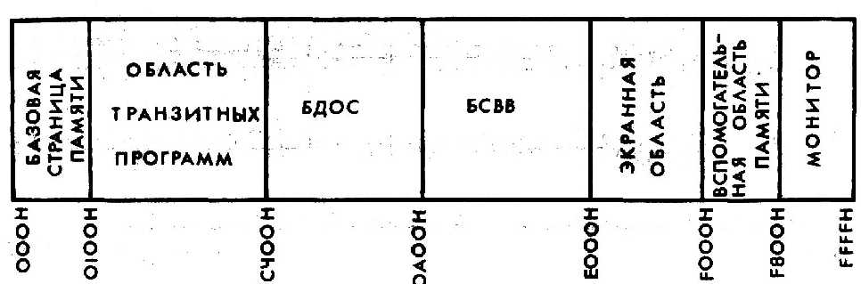
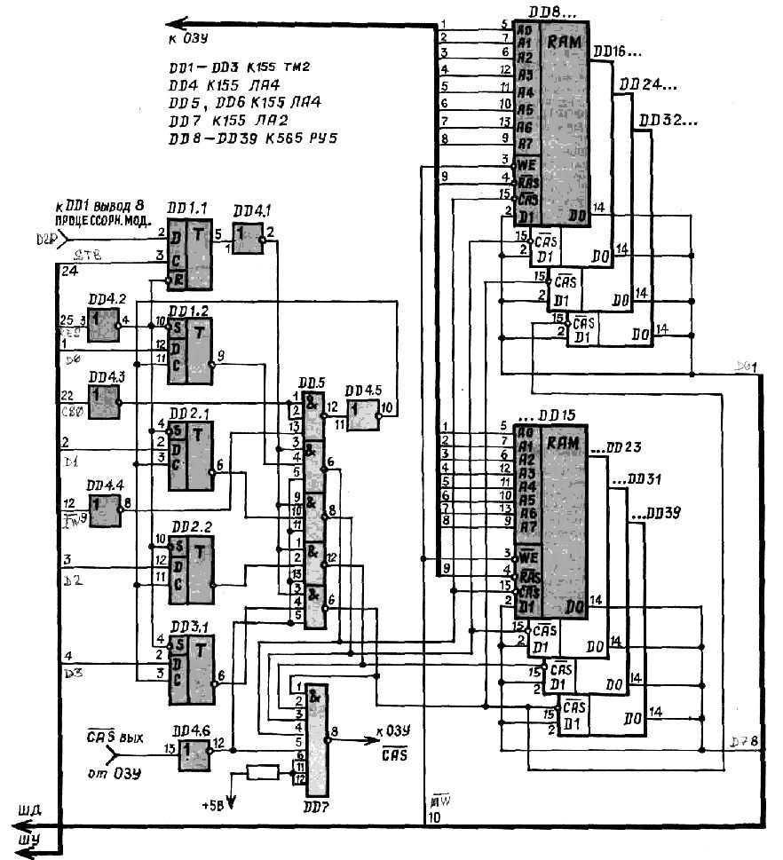

Ровно год назад вы познакомились с первым модулем микроЭВМ «ЮТ-88». За это время многие успели оснастить его модулями дополнительного ОЗУ и дисплея и пройти путь от программируемого микрокалькулятора до серьезного персонального компьютера. Теперь настало время рассказать о его программном обеспечении — операционных системах (ОС). Каждая из них представляет собой несколько специальных программ, предназначенных для управления всеми ресурсами компьютера и облегчения процесса создания и отладки новых программ. Иначе говоря, операционная система является как бы посредником между компьютером и его пользователем.

Предлагаем вам на выбор две операционные системы — ОС ЮТ-88, разработанную специально под наш компьютер, и всемирно известную ОС СР/М, для которой в мире уже созданы десятки тысяч самых разных прикладных программ.

## ОПЕРАЦИОННАЯ СИСТЕМА ЮТ-88 

(часть публикации опущена)

## ОПЕРАЦИОННАЯ СИСТЕМА СР/М

К сожалению, рассмотренная нами операционная система не обладает таким важным свойством, как файловая организация программ и данных. Файл — это место постоянного хранения информации. Благодаря удобству работы, скорости доступа к файлам, переносимости программ файловая структура является оптимальной для системного программного обеспечения современных персональных компьютеров.

Операционной системой такого рода является ОС СР/М. Она была создана Г. Килдэлом в 1975 году специально для микроЭВМ, сконструированных на микропроцессорах 8080 фирмы Интел (советский аналог — КР580ВМ80А). Сейчас ОС СР/М стала одной из наиболее популярных операционных систем и принята за своеобразный стандарт, поскольку используется многими производителями компьютеров в разных странах. Под нее созданы десятки тысяч прикладных программ. Разработан аналог СР/М и у нас в стране под названием МИКРОДОС.

ОС СР/М предназначена для использования совместно с мощным прикладным программным обеспечением, включая компиляторы языков высокого уровня (ФОРТРАН, ПАСКАЛЬ, СИ и др.), средства организации баз данных, экранные редакторы, игры и многое другое.

ОС СР/М — дисковая операционная система. Она предусматривает работу компьютера с накопителем на гибком магнитном диске. В нашем случае роль его будет выполнять электронный квазидиск, представляющий собой дополнительное ОЗУ объемом от 64 до 256 КБайт. Выбор емкости электронного квазидиска зависит от количества микросхем динамического ОЗУ, которое у вас окажется.

ОС СР/М состоит из двух частей: постоянной — Базовой Дисковой Операционной Системы (БДОС) и переменной — Базовой Системы Ввода/Вывода (БСВВ).

Постоянная часть БДОС может использоваться в разных компьютерах без изменений. Здесь имеется специальный программный модуль, который принимает и интерпретирует команды, вводимые с клавиатуры. Кроме того, БДОС организует управление ресурсами системы, и, прежде всего файлами, обменом информацией между различными периферийными устройствами. В БДОС входит ряд резидентных процедур управления работой дисковой системы (вывод на экран оглавления диска, удаления дискового файла и др.).

Переменная часть — БСВВ обеспечивает выполнение простейших операций передачи информации от микропроцессора к устройствам ввода/вывода с помощью драйверов нулевого уровня, входящих в МОНИТОР дисплейного модуля.

### Структура и размещение СР/М

Операционная система СР/М в виде распечатки шестнадцатиричных кодов представлена в таблице с метками СР/М-64. Кроме БДОС и БСВВ, она включает в себя еще и начальный загрузчик, обеспечивающий ее размещение, как в требуемых адресах ОЗУ компьютера, так и на соответствующих «дорожках» электронного квазидиска. Операционную систему первоначально набирают вручную по директиве «М» Монитора «ЮТ-88», проверяя правильность набора по блокам в 1 Кбайт по таблице контрольных сумм. В адреса 4BF0H-4FFFH во все ячейки директивой «F» заносится код Е5Н. Затем операционную систему записывают на магнитную ленту для последующего использования. Начальные адреса операционной системы 3100H-4FFFH. Для ее загрузки необходимо набрать директиву G3100. В результате чего она будет загружена как в ОЗУ, так и в квазидиск. При этом ей сразу передается управление.

### Контрольные суммы СР/М-64

<pre>
K3100, 33FF AC22
К3400, 37FF D667
К3800, 3BFF OFF5
К3С00, 3FFF 0F56
К4000, 43PF ЗВ98
К4400, 47FF 1А30
К4800, 4BFF ЕВЕ6
К4С00, 4FFF 9400
K3100, 4FFF 7782 
</pre>

В операционной системе СР/М часть ячеек ОЗУ в области 0000Н-0100Н отведена так называемой базовой страницей памяти. В ней записаны несколько сегментов кодов и данных, обеспечивающих вход в БД ОС и содержащих некоторые системные параметры. В частности, в ячейки 0-0002Н записан переход на БД ОС JMP DA03H, обеспечивающий перезапуск СР/М — «горячий» старт системы. В ячейку 0004Н записывается номер диска (начальный номер диска А-0). В ячейки 0005-0007Н записан переход на БДОС JMP CC06H. Этот переход может использоваться для вызова операций БДОС. Для этого размещают в регистр С номер функции, а в регистровую пару DE ее параметры, затем используют команду CALL 0005H.

### Перечень основных функций

{| class=border
| N || Название функции || Параметры
|-
| 0 || Завершение работы программы || С=0
|-
| 1 || Ввод символа с клавиатуры || С=1, символ в А
|-
| 1 || Вывод символа на экран || С=2, Е код символа
|-
| 6 || Ввод-вывод || С=6, Е код символа для вывода или E=FFH для ввода в А код введенного символа А=00, если символ не введен
|-
| 9 || Вывод на экран сообщения || С=9, DE — адрес начала сообщения
|-
| 10 || Ввод строки с клавиатуры || С=ОАН, DE — адрес буфера строки
|-
| 11 || Опрос состояния клавиатуры || С=ОВН А=00Н— код готовности A=FFH — код неготовности
|}

Область памяти с 100Н до нижнего адреса БДОС С400Н называется областью транзитных программ. Именно в нее загружаются прикладные программы для исполнения.

БДОС занимает адресное пространство от С400Н до D9FFH, а БСВВ от DA00H до DBFFH.

Базовая система ввода-вывода реализует набор простейших операций работы с устройствами ввода/вывода и с квазидиском. Только она непосредственно взаимодействует с внешними устройствами и зависит от их особенностей и характеристик. Все другие компоненты СР/М общаются с периферией только через БСВВ.

Для обращения к функциям БСВВ есть 17 точек входа, расположенных по фиксированным адресам. Они реализованы в БСВВ как «векторы переходов». Каждая из этих 17 команд передает управление некоторой из содержащихся внутри БСВВ подпрограмм или подпрограммам Монитора «ЮТ-88».

Точка входа в БСВВ — ячейка DA00H, и далее следует вектор перехода — последовательность еще 16 инструкций.

<pre>
DA00 JMP BOOT
DA03 JMP WBOOT
DA06 JMP CONST(F812 - активность клавиатуры)
DA09 JMP CONIN (F803 - прием с клавиатуры в А) 
DA0C JMP CONOUT (F809 - вывод на дисплей)
DA0F JMP LIST (F809 - вывод на дисплей) 
DA12 JMP PUNCH (F80C-вывод на магнитофон) 
DA15 JMP READER (F806-ввод с магнитофона) 
DA18 JMP HOME 
DA1B JMP SELDSK 
DA1E JMP SETTRC 
DA21 JMP SETSEC 
DA24 JMP SETDMA 
DA27 JMP READ 
DA2A JMP WRITE 
DA2D JMP LISTST 
DA30 JMP SECTRAN 
</pre>

Все переходы можно разбить на три группы:

* реинициализация СР/М (BOOT, WBOOT);
* ввод/вывод символов (CONST, CONIN, CONOUT, LIST, PUNCH, LISTST, READER)
* переходы на функции МОНИТОРА F
* ввод/вывод на диск (HOME, SELDSK, SETTRK, SETSEC, SETDMA, WRITE, SECTRAN).

Рассмотрим назначение отдельных точек входа, которые не связаны с функциями МОНИТОРА.

* BOOT—точка инициализации операционной системы после начальной загрузки СР/М;
* WBOOT—инициализация после перезапуска, так называемый «горячий старт». Вызвать «горячий старт» системы можно вводом с клавиатуры управляющего символа УС+ С;
* НОМЕ—установка головки текущего дисковода на нулевую дорожку;
* SELDSK —выбор указанного в С дисковода (0-А, 1-В, 2-С, 3-D);
* SETTRK — установка номера дорожки из С текущего дисковода;
* SETSEC — установка номера сектора текущего дисковода из регистра С;
* SETDMA—установка адреса для последующего прямого доступа к ОЗУ по ВС (В — старший байт адреса, С — младший байт адреса);
* READ — чтение одного сектора диска;
* WRITE — запись одного сектора на диск.

Важная особенность СР/М — возможность загрузки прикладных программ в память компьютера на место некоторых компонентов БДОС, если программа не обращается к системным вызовам. В этом случае под прикладную программу отводится свыше 52 Кбайт ОЗУ По окончании выполнения такой программы надо восстановить в памяти все компоненты СР/М и передать ей управление. Для этого после завершения работы прикладной программы необходимо передать управление на WBOOT («горячий старт»).

Распределение зон ОЗУ после загрузки в нее операционной системы СР/М показано на рисунке 1

### Файловая система СР/М

При использовании ОС СР/М у вас появится возможность снабдить программы и тексты, наборы символов и т. д. специальным именем и хранить их в виде записей на магнитной ленте. Такой набор записей, рассматриваемый в процессе пересылки и обработки как единое целое, и называется файлом.

Работа с файлами одна из основных задач СР/М и выполняется постоянной частью СР/М — БДОС. Файловая система СР/М автоматически распределяет место в оглавлении и области данных при создании и расширении файла и освобождает место, занятое файлом до его удаления. Если для исполнения операции в оглавлении или области данных диска нет места, то файловая система сообщает об этом.

ОС СР/М обеспечивает 4 вида операций: доступ к файлам, доступ к оглавлению (каталогу), доступ к диску и смешанные операции. Каждый файл имеет только ему принадлежащее имя, состоящее из собственно имени и типа файла, разделенных точкой. Имя файла можно составить максимум из восьми символов, исключая символы «*» и «?». Преимущественно используют латинские буквы и цифры. Для удобства применяются общепринятые названия типов файлов:

* .СОМ—транзитная команда, программа в машинном коде, готовая к исполнению;
* .MAC — программа на языке ассемблера (текст);
* .ТХТ — текстовый файл, подготовленный редактором;
* .BAS — программа на БЕЙСИКЕ (текст);
* .FOR — программа на ФОРТРАНЕ (текст);
* .HLP — текстовый файл с разъяснением прикладной программы.

Прежде чем рассмотреть эти операции, познакомимся с конкретной организацией гибкого диска и его электронного заменителя — квазидиска.

Диск состоит из 77 дорожек, пронумерованных от 0 до 76. На каждой дорожке находятся 26 секторов, и в каждом секторе 128 байт. Таким образом емкость диска равна 256 Кбайт. Это адресное пространство используется следующим образом: нулевая и первая дорожки содержат операционную систему СР/М. В частности, БДОС размещается в 26 секторах нулевой дорожки и в 19 секторах первой дорожки. Там размещается та же информация, что и в ОЗУ от С400Н до D9FFH. С 20 по 26-й сектор первой дорожки размещается БСВВ (DA00H-DBFFH). В 26 секторах второй дорожки содержатся оглавление и справочные данные о файлах, находящихся на диске

Электронный квазидиск — это модуль ОЗУ, подобный тому, который мы рассмотрели ранее с объемом памяти от 64 Кбайт до 256 Кбайт, имеющий дополнительные возможности по вводу/ выводу информации в соответствии с командами БСВВ. Существуют разные способы организации обмена информацией с электронным квазидиском. Можно использовать дополнительные порты приема и выдачи данных на квазидиск, порт управления и порты адресации. Однако проще всего осуществить обмен с квазидиском, инициализируя его как адресное пространство стека.

На рисунке 2 изображена электрическая схема квазидиска. Кроме микросхем ОЗУ, в него входят еще семь микросхем. Микросхемы ОЗУ включаются параллельно тем, что используются в модуле ОЗУ. Всего может быть от одного до четырех блоков по восемь микросхем К565РУ5 в каждом.

Отдельно у этих блоков включаются только выводы CAS:

* CAS 1 (квазидиск на 64 К, микросхемы ОЗУ DD8-DD15),
* CAS 2 (квазидиск на 128 К, микросхемы ОЗУ DD16-DD23),
* CAS 3 (квазидиск на 192 К, микросхемыDD24-DD31),
* CAS 4 (квазидиск на 256 К, микросхемы DD32-DD39).

Такое простое взаимодействие с квазидиском достигнуто благодаря дополнительному управляющему сигналу, который формируется на микросхеме DD 1.1 из слова состояния (2-й разряд) и который активен, когда идет обращение к стеку. Таким образом, при обращении к стеку, когда в порт 40Н записано 00, электронный квазидиск «открывается». Если инициализация порта 40 не произведена, то стек формируется, как обычно, в адресном пространстве основного ОЗУ.

Каждый из блоков дополнительной памяти имитирует диск со следующими параметрами:

* общая емкость — 64 Кбайт
* число «дорожек» — 64
* число секторов на дорожке — 8

Приведенная распечатка кодов загрузчика СР/М соответствует объему ОЗУ в 256 КБайт. При использовании меньшего объема диска в ячейку ОЗУ загрузчика СР/М 4А50Н следует ввести поправку:

* для диска объемом 64 Кбайт—39Н
* для диска объемом 128 Кбайт — 79Н
* для диска объемом 192 Кбайта — В9Н

Как уже отмечалось, загрузка операционной системы СР/М осуществляется командой Монитора G3100. После этого на экране дисплея появляется сообщение:

<pre>
СРМ V-2, 2 ДИСК РАМ 256 К 
А> 
</pre>

Появление на экране дисплея сообщения — подсказки А> говорит о готовности ОС СР/М к работе и приему команды. Если ввести некоторый произвольный набор символов, например:

<pre>
А> ВВ 
</pre>

и нажать клавишу «ВК», то в ответ получим:

<pre>
ВВ?
А> 
</pre>

При подаче в компьютер несуществующей или синтаксически ошибочной команды система выполнить ее не может. Она повторит введенную серию символов с дополнением знака вопроса и перейдет в режим ожидания новой команды, выдавая подсказку
А>.

Если при наборе команды замечена ошибка еще до нажатия клавиши ВК, то можно вернуться назад клавишей ПРОБЕЛ или одновременным нажатием клавиш УС+ Н.

В СР/М имеется еще ряд полезных управляющих символов:

* УС +X удаляет последнюю строку символов;
* УС+ М — эквивалент нажатия ВК;
* УС+ J — эквивалент перевода строки;
* УС+ S приостанавливает вывод текста на дисплей. Повторное нажатие возобновляет вывод текста.

Используемые в СР/М команды разбиваются на две категории:

* Встроенные команды («резидентные»),
* Транзитные команды.

Встроенные команды, по сути, являются частью операционной системы СР/М. Обращение к ним осуществляется простым вводом имени соответствующей команды независимо от того, имеется ли в данный момент в системе квазидиск.

В СР/М имеются следующие встроенные команды:

* DIR — просмотр оглавления диска;
* REN — переименование файлов;
* ERA—удаление файлов;
* TYPE — просмотр содержимого файла;
* SAVE — сохранение на диске области ОЗУ в виде файла.

Например, если набрать команду DIR и нажать ВК, то есть А> DIR (ВК), то поскольку в ОЗУ квазидиска отсутствуют какие-либо файлы, на экран дисплея будет выдано следующее сообщение:

<pre>
No files 
А>
</pre>

Работу со встроенными командами мы рассмотрим в дальнейшем, а сейчас перейдем к транзитным командам, которые хранятся на диске в отдельных файлах с именами, оканчивающимися расширением «СОМ». Транзитные команды, по сути дела, являются программами СР/М, но термин «транзитные» подчеркивает, что их программы можно загружать в оперативную память с адреса 100Н, затем занести в диск, а при необходимости и удалить. Все транзитные команды в нашем случае, учитывая работу с электронным квазидиском, будут храниться на кассетах. Впрочем, если приспособить для питания квазидиска автомобильный аккумулятор, то отпадет необходимость в перезагрузке квазидиска рабочими программами при перерывах в работе с отключением питания.

Для вызова транзитных команд на исполнение достаточно просто ввести имя файла без расширения «СОМ». СР/М определит наличие файла с указанным именем и расширением «СОМ» в каталоге квазидиска и при его обнаружении вызовет данную программу на исполнение. В СР/М имеется множество транзитных командных файлов, многие из которых приведены в перечне приложения.

В качестве примера рассмотрим работу транзитной команды СН.СОМ. Таблица распечатки командного файла в шестнадцатиричных кодах приведена в таблице с меткой СН.СОМ. В Мониторе ЮТ-88 эта программа набирается с адреса 100Н и записывается на кассету. Предварительно загруженная операционная система СР/М перезапускается директивой «G» с адреса DA00H, в результате чего на экране появится подсказка:

<pre>
А>
</pre>

Чтобы занести файл СН.СОМ, который расположен в адресном пространстве 100H-3FFH, воспользуемся резидентной командой SAVE, формат командной строки которой требует указания дополнительной информации: число сохраняемых на диске страниц памяти и имя файла. Одна страница памяти составляет 256 байт.

Наберем текст:

<pre>
A> SAVE 3 СН.СОМ (ВК)
</pre>

В результате чего командный файл СН.СОМ будет занесен на диск. Воспользуемся командой DIR:

<pre>
A> DIR (ВК)
</pre>

На экране получим ответ, подтверждающий наличие в каталоге СН.СОМ

<pre>
А: СН СОМ
А>
</pre>

Файл СН.СОМ используется чаще всего, так как с его помощью будет осуществляться обмен файлами между диском и кассетным магнитофоном.

Чтобы проиллюстрировать работу СН.СОМ, создадим с помощью встроенной команды SAVE некоторый вспомогательный, небольшой по объему файл:

<pre>
A> SAVE I EX.COM (ВК)
</pre>

Проверим его наличие в каталоге с помощью команды DIR:

<pre>
А: СН СОМ: ЕХ СОМ
А> 
</pre>

Теперь на диске два файла. Запишем вспомогательный файл ЕХ.СОМ на магнитную ленту кассетного магнитофона. Для этого наберем текст:

<pre>
А> СН ЕХ.СОМ (ВК)
</pre>

В результате на дисплее появится сообщение

<pre>
CHANGER VERS1.1 READY 
TR FOR OUTPUT, PRESS CR, 
</pre>

означающее, что если магнитофон к записи готов и его лентопротяжный механизм включен, нужно нажать на клавишу ВК. После записи файла на магнитофон на экране появляется сообщение:

<pre>
READY 
TR FOR VERIFY, PRESS CR. 
</pre>

Если магнитофон готов к проверке записи, нужно нажать ВК. Если запись сделана с ошибкой, то на дисплее появится сообщение:

<pre>
VERIFY ERROR. 
</pre>

В противном случае никакого сообщения не будет, а на экране вновь появится подсказка
А>.

С помощью встроенной команды уничтожим вспомогательный файл на диске:

<pre>
A> ERA ЕХ.СОМ (ВК)
</pre>

Если теперь вывести оглавление диска, то

<pre>
А> DIR (ВК) 
А: СН СОМ, то есть ЕХ.СОМ на диске уничтожен. 
</pre>

Восстановим файл ЕХ.СОМ на диске, считав его с кассетного магнитофона. Для этого следует набрать:

<pre>
А> СН ЕХ.СОМ (ВК)
</pre>

Отсутствие имени файла в каталоге диска приводит к режиму чтения файла с магнитной ленты. На дисплее появится сообщение

<pre>
READY 
TR FOR INPUT, PRESS CR. 
</pre>

При готовности магнитофона для воспроизведения записи нужно нажать ВК. Если файл правильно считался в ОЗУ диска, появляется подсказка А>.

Проверить загрузку файла можно, опять применив команду DIR. При чтении файла возможны различные сообщения: NO SOURCE PRESENT, READ ERROR означает — файл не указан в командной строке или чтение с ошибкой. NO DIRECTORY SPACE означает, что не хватает памяти в каталоге диска. NOT ENOUGH MEMORY означает, что недостаточно места в ОЗУ электронного диска.

Рассмотрим работу с еще одним, часто используемым файлом STAT.COM, который применяется для получения списка имен файлов на диске, определения размеров файлов, определения объема неиспользованного дискового пространства и для выполнения других функций. Предположим, что с помощью СН.СОМ мы считали STAT.COM на диск. При последовательном вводе команд STAT (ВК) на дисплей выдается информация о состоянии квазидиска:

<pre>
A: R/W, SPACE: 152K 
А> 
</pre>

Это сообщение означает, что квазидиск установлен в режим ЧТЕНИЕ/ЗАПИСЬ и что объем оставшегося на диске свободного для доступа пространства, выраженный в килобайтах, составляет 152 К. Команда STAT позволяет изменять статус диска, защитив его от возможной записи. Чтобы установить режим «ТОЛЬКО ЧТЕНИЕ», необходимо набрать сообщение:

<pre>
A> STAT A: R/0
</pre>

Исполнение команды проверим:

<pre>
A> STAT (ВК)
A: R/0, SPACE: 152K 
А> 
</pre>

Команда STAT позволяет выводить на дисплей характеристики файлов.

<pre>
A> STAT*.* (ВК)
</pre>

В результате обработки команды будут выданы характеристики всех файлов, которые хранятся на квазидиске. В нашем случае на нем имеется только один файл.

<pre>
RECS BYTES ЕХТ АСС
41 6К 1 R/0 A: STAT.COMBYTES 
REMAINING ON A: 152K
A> 
</pre>

Представленные характеристики имеют следующий смысл:

* RECS—определяет количество записей, из которых состоит данный файл. Одна запись содержит 128 байт;
* BYTES — определяет округленное значение размера файла в килобайтах;
* ЕХТ— это еще одна единица измерения размера файла экстент, если файл не превышает 16К, то выдается 1;
* АСС—от английского слова ACCESS — означает статус доступа к файлу, R/0 —только чтение.

Команду STAT можно использовать для спецификации файла, полное имя или расширение которого вы не помните, или когда вам известны некоторые символы из этого имени. Известные символы дополняют метасимволами «*» и «?» или их комбинациями. Например:

<pre>
STAT FILE.* 
STAT*.СОМ
STAT FI??.? 0? 
STAT F??.* и т.д. 
* — используется для обозначения группы символов;
? — используется для обозначения одного символа. 
</pre>

Их можно использовать и со встроенными командами DIR и ERA. В остальных случаях их применение приводит к возникновению ошибок. В нашем первом примере командой STAT будут выведены характеристики всех файлов с именем FILE и любым расширением. Во втором примере команда STAT выдаст характеристики только командных файлов. Третий приведет к выводу на экран всех файлов, у которых имена начинаются с букв F1 и двумя любыми другими буквами и имеющих расширение с буквой О в середине. В четвертом случае будут выданы характеристики всех файлов, начинающихся буквой F и имеющих любое расширение.

В имени файла может быть указано не более восьми метасимволов, а в расширении — не более трех.

С помощью встроенной команды REN можно переименовать файл. Например:

<pre>
A> REN FILE.COM=STAT.COM (BK) 
А> 
</pre>

Однако если статус у файла «только чтение», то его переименовать нельзя.

С помощью команды TYPE можно выводить на дисплей текстовые файлы.

С командой ERA мы уже знакомы. С ее помощью удаляются с диска файлы. Например:

<pre>
A> ERA FILE. СОМ (BK) 
А> 
</pre>

Если теперь вывести оглавление диска, то

<pre>
A> DIR (ВК)
NO files
А>
</pre>

то есть файл на диске уничтожен.

С командой ERA возможно использование метасимволов, например, для удаления всех файлов

<pre>
A> ERA*.* (ВК)
</pre>

Файлы, имеющие статус «ТОЛЬКО ЧТЕНИЕ», удалены быть не могут.

Во избежание неожиданностей при использовании метасимволов с командой ERA прежде используйте команду DIR с той же последовательностью метасимволов, проверив все файлы, входящие в группу до их удаления.

В заключение приведем еще одну версию операционной системы СР/М, для реализации которой не требуется дополнительного блока ОЗУ Электронный квазидиск, с которым работает эта версия СР/М, создается в адресном пространстве компьютера за счет сокращения рабочей области ОЗУ. Конечно, ограниченный объем рабочей области ОЗУ и квазидиска хоть не дает возможности использовать все преимущества файловой организации СР/М, но данная версия позволяет в полной мере освоить работу с резидентными командами и описанным выше СН.СОМ, загружая небольшие по объему файлы с кассетного магнитофона.

Таблица распечатки кодов обозначена метками СР/М 35. Пусковой адрес 4А00Н.

Контрольные суммы СР/М-35

<pre>
К3400, 37FF 7АВ9
K3800, 3BFF A41E
КЗС00, 3FFF AA1F
К4000, 43FF D0B8
К4400, 47FF ADA0
К4800, 4BFF 7D22
К4С00, 4С55 1DA1
К3100, 4С55 Е211 
</pre>

В. БАРТЕНЕВ при участии И. Грищенко, А. Блохина, и С. Аксенова

